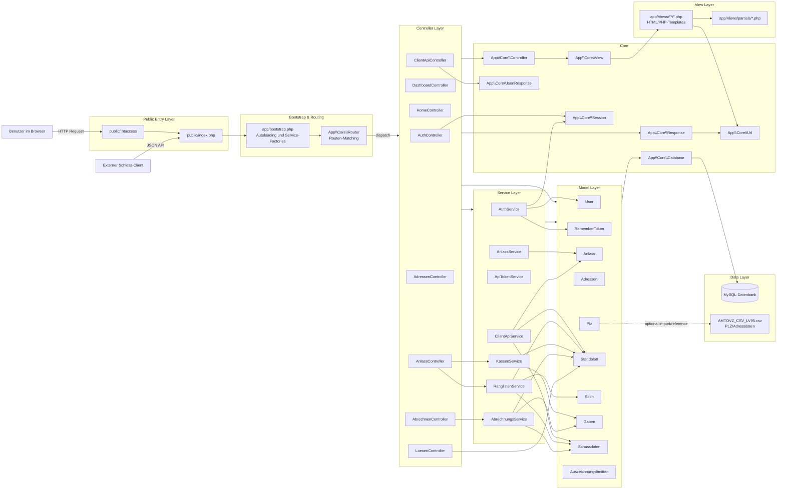
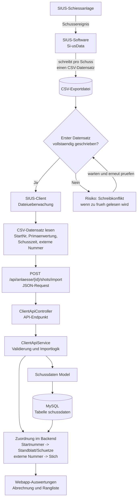

# Architekturmodell der Webapp

## Kurzbeschreibung

Die Anwendung ist als klassische PHP-MVC-Webapp aufgebaut:

- `public/index.php` ist der zentrale Einstiegspunkt fuer alle Web- und API-Anfragen.
- `app/bootstrap.php` registriert Autoloading und erzeugt wiederverwendete Services.
- `Router` ordnet HTTP-Routen den passenden Controllern zu.
- Controller verarbeiten Requests, pruefen Login/Parameter und delegieren Logik an Services oder Models.
- Services buendeln fachliche Ablaufe wie Authentifizierung, Ranglisten, Kasse, API-Import und Abrechnung.
- Models kapseln SQL-Zugriffe und nutzen zentral `App\Core\Database`.
- Views sind PHP-Templates und werden ueber `App\Core\View` gerendert.

## 5.4 Datenfluss SIUS-Schnittstelle

Der Datenaustausch mit der Schiessanlage erfolgt ueber CSV-Dateien, die von der SIUS-Software Si-usData erzeugt werden. Fuer jeden Schuss schreibt SIUS einen eigenen Datensatz in die Exportdatei. Dieser Datensatz enthaelt unter anderem die Startnummer, die Primaerwertung, den Zeitpunkt des Schusses sowie die externe Nummer des geschossenen Stichs.

Der SIUS-Client ueberwacht die CSV-Datei laufend. Sobald neue Schussdaten vorhanden sind, liest der Client die relevanten Felder aus und uebertraegt sie ueber die JSON-Schnittstelle an die Webapplikation. Im Backend nimmt der `ClientApiController` die Daten entgegen und gibt sie an den `ClientApiService` weiter. Dort werden die Schussdaten validiert, fuer den Import vorbereitet und ueber das Model `Schussdaten` in der Datenbank gespeichert. Anschliessend koennen die Daten ueber Startnummer und externe Nummer dem passenden Standblatt, Schuetzen und Stich zugeordnet werden.

Wichtig ist, dass die CSV-Datei erst gelesen wird, nachdem SIUS mindestens den ersten Datensatz vollstaendig geschrieben hat. Wird die Datei zu frueh geoeffnet oder gelesen, kann es zu Schreibkonflikten mit der SIUS-Software kommen. Diese Problematik wurde bereits praktisch an einem Volksschiessen in Lachen beobachtet und muss beim Betrieb des Clients beruecksichtigt werden.

Der fachliche Nutzen dieses Datenflusses liegt darin, dass Resultate nicht manuell in der Webapplikation erfasst werden muessen. Die von SIUS gelieferten Schussdaten werden automatisiert importiert und stehen danach fuer die Funktionen FA-01 und FA-04 zur Verfuegung, insbesondere fuer die Zuordnung zu geloesten Standblaettern, die Abrechnung und die Ranglistenauswertung.
