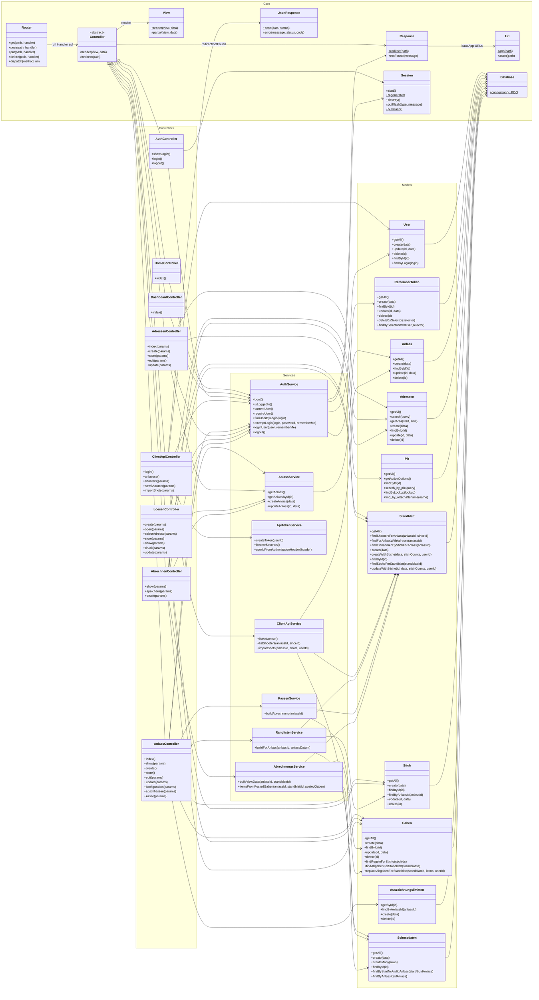

# Klassendiagramm der Webapp

```mermaid
classDiagram
    direction LR

    namespace Core {
        class Router {
            +get(path, handler)
            +post(path, handler)
            +put(path, handler)
            +delete(path, handler)
            +dispatch(method, uri)
        }

        class Controller {
            <<abstract>>
            #render(view, data)
            #redirect(path)
        }

        class View {
            +render(view, data)$
            +partial(view, data)$
        }

        class Response {
            +redirect(path)$
            +notFound(message)$
        }

        class JsonResponse {
            +send(data, status)$
            +error(message, status, code)$
        }

        class Session {
            +start()$
            +regenerate()$
            +destroy()$
            +putFlash(type, message)$
            +pullFlash()$
        }

        class Url {
            +app(path)$
            +asset(path)$
        }

        class Database {
            +connection() PDO$
        }
    }

    namespace Controllers {
        class HomeController {
            +index()
        }

        class DashboardController {
            +index()
        }

        class AuthController {
            +showLogin()
            +login()
            +logout()
        }

        class ClientApiController {
            +login()
            +anlaesse()
            +shooters(params)
            +newShooters(params)
            +importShots(params)
        }

        class AnlassController {
            +index()
            +show(params)
            +create()
            +store()
            +edit(params)
            +update(params)
            +konfiguration(params)
            +abschliessen(params)
            +kasse(params)
        }

        class AdressenController {
            +index(params)
            +create(params)
            +store(params)
            +edit(params)
            +update(params)
        }

        class LoesenController {
            +create(params)
            +open(params)
            +selectAdresse(params)
            +store(params)
            +show(params)
            +druck(params)
            +update(params)
        }

        class AbrechnenController {
            +show(params)
            +speichern(params)
            +druck(params)
        }
    }

    namespace Services {
        class AuthService {
            +boot()
            +isLoggedIn()
            +currentUser()
            +requireUser()
            +findUserByLogin(login)
            +attemptLogin(login, password, rememberMe)
            +loginUser(user, rememberMe)
            +logout()
        }

        class AnlassService {
            +getAnlass()
            +getAnlassById(id)
            +createAnlass(data)
            +updateAnlass(id, data)
        }

        class ApiTokenService {
            +createToken(userId)
            +lifetimeSeconds()
            +userIdFromAuthorizationHeader(header)
        }

        class ClientApiService {
            +listAnlaesse()
            +listShooters(anlassId, sinceId)
            +importShots(anlassId, shots, userId)
        }

        class RanglistenService {
            +buildForAnlass(anlassId, anlassDatum)
        }

        class KassenService {
            +buildAbrechnung(anlassId)
        }

        class AbrechnungsService {
            +buildViewData(anlassId, standblattId)
            +itemsFromPostedGaben(anlassId, standblattId, postedGaben)
        }
    }

    namespace Models {
        class User {
            +getAll()
            +create(data)
            +update(id, data)
            +delete(id)
            +findById(id)
            +findByLogin(login)
        }

        class RememberToken {
            +getAll()
            +create(data)
            +findById(id)
            +update(id, data)
            +delete(id)
            +deleteBySelector(selector)
            +findBySelectorWithUser(selector)
        }

        class Anlass {
            +getAll()
            +create(data)
            +findById(id)
            +update(id, data)
            +delete(id)
        }

        class Adressen {
            +getAll()
            +search(query)
            +getArea(start, limit)
            +create(data)
            +findById(id)
            +update(id, data)
            +delete(id)
        }

        class Plz {
            +getAll()
            +getActiveOptions()
            +findById(id)
            +search_by_plz(query)
            +findByLookup(lookup)
            +find_by_ortschaftsname(name)
        }

        class Standblatt {
            +getAll()
            +findShootersForAnlass(anlassId, sinceId)
            +findForAnlassWithAdresse(anlassId)
            +findEinnahmenByStichForAnlass(anlassId)
            +create(data)
            +createWithStiche(data, stichCounts, userId)
            +findById(id)
            +findSticheForStandblatt(standblattId)
            +updateWithStiche(id, data, stichCounts, userId)
        }

        class Stich {
            +getAll()
            +create(data)
            +findById(id)
            +findByAnlassId(anlassId)
            +update(id, data)
            +delete(id)
        }

        class Gaben {
            +getAll()
            +create(data)
            +findById(id)
            +update(id, data)
            +delete(id)
            +findRegelnForStiche(stichIds)
            +findAbgabenForStandblatt(standblattId)
            +replaceAbgabenForStandblatt(standblattId, items, userId)
        }

        class Auszeichnungslimitten {
            +getById(id)
            +findByAnlassId(anlassId)
            +create(data)
            +delete(id)
        }

        class Schussdaten {
            +getAll()
            +create(data)
            +createMany(rows)
            +findById(id)
            +findByStartNrAndIdAnlass(startNr, idAnlass)
            +findByAnlassId(idAnlass)
        }
    }

    Router --> Controller : ruft Handler auf
    Controller --> View : rendert
    Controller --> Response : redirect/notFound
    Response --> Url : baut App-URLs

    Controller <|-- HomeController
    Controller <|-- DashboardController
    Controller <|-- AuthController
    Controller <|-- ClientApiController
    Controller <|-- AnlassController
    Controller <|-- AdressenController
    Controller <|-- LoesenController
    Controller <|-- AbrechnenController

    HomeController --> AuthService
    DashboardController --> AuthService
    AuthController --> AuthService
    AuthController --> Session
    ClientApiController --> AuthService
    ClientApiController --> ApiTokenService
    ClientApiController --> ClientApiService
    ClientApiController --> User
    ClientApiController --> JsonResponse

    AnlassController --> AuthService
    AnlassController --> AnlassService
    AnlassController --> Gaben
    AnlassController --> Stich
    AnlassController --> Auszeichnungslimitten
    AnlassController --> RanglistenService
    AnlassController --> KassenService

    AdressenController --> AuthService
    AdressenController --> AnlassService
    AdressenController --> Adressen
    AdressenController --> Plz

    LoesenController --> AuthService
    LoesenController --> AnlassService
    LoesenController --> Adressen
    LoesenController --> Standblatt
    LoesenController --> Stich
    LoesenController --> Gaben

    AbrechnenController --> AuthService
    AbrechnenController --> AnlassService
    AbrechnenController --> Adressen
    AbrechnenController --> Standblatt
    AbrechnenController --> Gaben
    AbrechnenController --> AbrechnungsService

    AuthService --> User
    AuthService --> RememberToken
    AuthService --> Session
    AuthService --> Response
    AnlassService --> Anlass
    ClientApiService --> Anlass
    ClientApiService --> Standblatt
    ClientApiService --> Schussdaten
    RanglistenService --> Stich
    RanglistenService --> Standblatt
    RanglistenService --> Schussdaten
    KassenService --> Standblatt
    KassenService --> Gaben
    AbrechnungsService --> Standblatt
    AbrechnungsService --> Schussdaten
    AbrechnungsService --> Gaben

    User --> Database
    RememberToken --> Database
    Anlass --> Database
    Adressen --> Database
    Plz --> Database
    Standblatt --> Database
    Stich --> Database
    Gaben --> Database
    Auszeichnungslimitten --> Database
    Schussdaten --> Database
```
