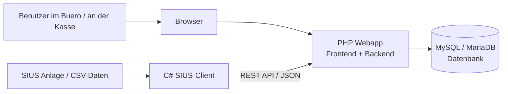

# Zusammenfassung der Software

Diese Datei fasst die Webapplikation so zusammen, dass eine naechste KI die Dokumentation oder Abschlussarbeit weiter ausfuellen kann. Die Struktur orientiert sich an den Kapiteln 6.1 bis 6.10.

## 6.1 Ziel der Webapplikation

Die Webapplikation soll die zentrale Anwendung fuer einen Schiessanlass werden. Sie ersetzt eine alte, veraltete und schwer wartbare Software durch eine moderne Webloesung, die im Browser bedient werden kann und alle wichtigen Ablaufe rund um den Anlass zusammenfuehrt.

Geloeste Probleme:

- Die alte Software ist nicht gut wartbar und nur schwer erweiterbar.
- Daten zu Anlaessen, Schuetzen, Standblaettern, Zahlungen und Resultaten sollen nicht mehr verteilt oder manuell verwaltet werden.
- Schussdaten aus SIUS sollen automatisiert uebernommen werden.
- Ranglisten, Abrechnung und Druckunterlagen sollen aus denselben Daten entstehen.

Zentrale Funktionen:

- Benutzer-Login fuer den geschuetzten Bereich
- Anlaesse erstellen, bearbeiten, konfigurieren und auswaehlen
- Schuetzen und Adressen verwalten
- Standblaetter loesen, bearbeiten und drucken
- Stiche, Gaben und Auszeichnungslimiten konfigurieren
- Kassen- und Standblattabrechnung
- Ranglisten anzeigen
- Schussdaten vom SIUS-Client per REST-API importieren

## 6.2 Systemuebersicht / Architektur

Die Software besteht aus einer PHP-Webapplikation, einer MySQL/MariaDB-Datenbank und einem separaten Client fuer die SIUS-Anbindung. Die Webapplikation stellt sowohl die Benutzeroberflaeche als auch die REST-API fuer den Client bereit.



Architektur im Projekt:

- Einstiegspunkt: [public/index.php](/var/www/html/public/index.php)
- Routing: [app/Core/Router.php](/var/www/html/app/Core/Router.php)
- Controller: [app/Controllers](/var/www/html/app/Controllers)
- Services fuer Geschaeftslogik: [app/Services](/var/www/html/app/Services)
- Models fuer Datenbankzugriff: [app/Models](/var/www/html/app/Models)
- Views fuer HTML-Oberflaechen: [app/Views](/var/www/html/app/Views)
- SIUS-/Windows-Client: [client/Form1.cs](/var/www/html/client/Form1.cs)
- Datenbankschema: [schema.sql](/var/www/html/schema.sql)

## 6.3 Technologieentscheid

Verwendete Technologien:

- Frontend: HTML, PHP-Views, Bootstrap 5, wenig eigenes CSS
- Backend: PHP mit eigener kleiner MVC-Struktur
- Routing: eigener Router in `app/Core/Router.php`
- Datenbank: MySQL/MariaDB
- Datenzugriff: PDO ueber die Database-Klasse
- Kommunikation mit dem Client: REST-API mit JSON
- Authentifizierung Web: PHP-Session und optional Remember-Me-Cookie
- Authentifizierung API: Bearer Token mit HMAC-Signatur
- SIUS-Client: C# Windows-Client

Wichtige API-Beispiele:

- `POST /api/login`
- `GET /api/anlaesse`
- `GET /api/anlaesse/{id}/shooters`
- `GET /api/anlaesse/{id}/shooters/new?sinceId=...`
- `POST /api/anlaesse/{id}/shots/import`

## 6.4 Frontend (Benutzeroberflaeche)

Die Benutzeroberflaeche ist als serverseitig gerenderte PHP-Webapp aufgebaut. Das Design basiert auf Bootstrap 5 und der eigenen Datei [public/assets/css/app.css](/var/www/html/public/assets/css/app.css). Die Seiten verwenden einen hellen Hintergrund, Kartenbereiche, klare Buttons und deutschsprachige Fachbegriffe.

Wichtige Seiten:

- Login: `/login`
- Dashboard: `/dashboard`
- Anlassauswahl: `/anlass`
- Neuer Anlass: `/anlass/neu`
- Anlassdetail: `/anlass/{id}`
- Anlass konfigurieren: `/anlass/{id}/konfiguration`
- Schuetzenverwaltung: `/anlass/{id}/schuetzen`
- Standblatt loesen: `/anlass/{id}/loesen/neu`
- Standblatt auswaehlen: `/anlass/{id}/loesen`
- Standblatt abrechnen: `/anlass/{id}/loesen/{standblattId}/abrechnen`
- Kassenuebersicht: `/anlass/{id}/kasse`
- Rangliste: `/anlass/{id}/abschliessen`

Screenshot-Platzhalter fuer die Dokumentation:

- Screenshot Login
- Screenshot Anlassauswahl
- Screenshot Anlassdetail mit Aktionen
- Screenshot Standblatt / Schuetzenverwaltung
- Screenshot Abrechnung oder Rangliste

## 6.5 Backend (Serverlogik)

Das Backend ist in Controller, Services und Models aufgeteilt.

Controller:

- `AuthController`: Login, Logout und Loginformular
- `DashboardController`: geschuetzter Einstieg
- `AnlassController`: Anlaesse, Konfiguration, Gaben, Regeln, Rangliste und Kasse
- `AdressenController`: Schuetzen- und Adressverwaltung
- `LoesenController`: Standblaetter loesen, anzeigen, bearbeiten und drucken
- `AbrechnenController`: Abrechnung und Druck
- `ClientApiController`: REST-API fuer den SIUS-Client

Services:

- `AuthService`: Session-Login und Remember-Me
- `ApiTokenService`: API-Tokens fuer den Client
- `ClientApiService`: Anlaesse, Schuetzen und Schussimport fuer die API
- `AnlassService`: Anlasslogik
- `RanglistenService`: Ranglistenberechnung
- `KassenService`: Kassenuebersicht
- `AbrechnungsService`: Abrechnung von Standblaettern

API-Ablauf:

1. Client sendet Login an `POST /api/login`.
2. Server prueft Benutzername und Passwort.
3. Server gibt ein Bearer Token zurueck.
4. Client ruft Anlaesse und Schuetzen mit `Authorization: Bearer <token>` ab.
5. Client sendet Schussdaten als JSON an `/api/anlaesse/{id}/shots/import`.
6. Server speichert die Daten in der Tabelle `schussdaten`.

## 6.6 Datenmodell (Datenbank)

Das Datenmodell ist in [schema.sql](/var/www/html/schema.sql) definiert.

Wichtige Tabellen:

- `users`: Benutzer der Webapp
- `user_remember_tokens`: Remember-Me-Tokens fuer Web-Login
- `plz`: Postleitzahlen und Ortsdaten
- `adressen`: Personen, Schuetzen und Kontaktdaten
- `anlass`: Schiessanlaesse
- `stich`: Stiche eines Anlasses
- `gaben`: Preise oder Auszeichnungen
- `auszeichnungslimiten`: Regeln fuer Auszeichnungen
- `standblatt`: Teilnahme/Standblatt eines Schuetzen an einem Anlass
- `standblatt_stich`: Verbindung zwischen Standblatt und Stich
- `gaben_abgaben`: abgegebene Gaben pro Standblatt und Stich
- `schussdaten`: importierte SIUS-Schussdaten

Beziehungen:

- Ein Anlass hat mehrere Stiche.
- Ein Anlass hat mehrere Standblaetter.
- Ein Standblatt gehoert zu genau einer Adresse und einem Anlass.
- Ein Standblatt kann mehrere Stiche enthalten.
- Schussdaten gehoeren zu einem Anlass.
- Gaben koennen ueber Auszeichnungslimiten mit Stichen verknuepft werden.

SIUS-relevante Felder in `schussdaten`:

- `start_nr`
- `primaerwertung`
- `schussart`
- `bahn_nr`
- `sekundaerwertung`
- `teiler`
- `schuss_zeit`
- `mouche`
- `x_koordinate`
- `y_koordinate`
- `gruppe`
- `feuerart`
- `waffe`
- `position`
- `target_id`
- `externe_nummer`

## 6.7 Schnittstelle zum SIUS-Client

Die Schnittstelle zum SIUS-Client ist ein zentraler Teil der Arbeit. Der Client liest bzw. verarbeitet Schussdaten aus der SIUS-Umgebung und sendet diese an die Webapp.

Vorgesehener Ablauf:

1. SIUS erzeugt oder liefert Schussdaten, zum Beispiel als CSV.
2. Der Client liest diese Datei oder Datenquelle ein.
3. Der Client wandelt die CSV-Daten in JSON um.
4. Der Client meldet sich an der Webapp ueber `POST /api/login` an.
5. Der Client waehlt den passenden Anlass.
6. Der Client sendet die Schussdaten an `POST /api/anlaesse/{id}/shots/import`.
7. Die Webapp validiert Token und Anlass.
8. Die Webapp speichert die Schuesse in `schussdaten`.
9. Ranglisten und Auswertungen koennen auf diesen Daten aufbauen.

Beispiel fuer den JSON-Import:

```json
{
  "AnlassId": 1,
  "Shots": [
    {
      "StartNr": "25",
      "Primaerwertung": "10.2",
      "Schussart": "Probe",
      "BahnNr": "3",
      "Sekundaerwertung": "10",
      "Teiler": "42.5",
      "Zeit": "2026-04-27 14:30:00",
      "Mouche": 1,
      "X": "0.1234",
      "Y": "-0.2345",
      "Waffe": "Gewehr",
      "Position": "liegend"
    }
  ]
}
```

Der Service [app/Services/ClientApiService.php](/var/www/html/app/Services/ClientApiService.php) bildet die JSON-Felder auf die Datenbankspalten ab.

## 6.8 Sicherheit & Zugriff

Die Webapp verwendet zwei Formen der Authentifizierung.

Web-Login:

- Benutzer melden sich ueber `/login` an.
- Passwoerter werden mit `password_hash()` gespeichert und mit `password_verify()` geprueft.
- Geschuetzte Seiten verwenden den `AuthService`.
- Optional gibt es Remember-Me-Tokens in der Tabelle `user_remember_tokens`.

API-Zugriff:

- Der Client meldet sich ueber `POST /api/login` an.
- Die API gibt ein Token mit Ablaufzeit zurueck.
- Der Client sendet danach `Authorization: Bearer <token>`.
- `ApiTokenService` prueft Signatur und Ablaufzeit.
- Token laufen aktuell nach 3600 Sekunden ab.

Noch ausbaubare Sicherheitsbereiche:

- differenzierte Benutzerrollen
- Rechte pro Bereich, z. B. Kasse, Administration, Auswertung
- staerkere Validierung der importierten Schussdaten
- Protokollierung kritischer Aktionen

## 6.9 Besonderheiten / Herausforderungen

Wichtige Herausforderungen der Software:

- SIUS liefert Schussdaten laufend und in einem technischen Format.
- CSV-Daten muessen korrekt in JSON und danach in Datenbankfelder umgewandelt werden.
- Startnummern muessen eindeutig genug sein, damit Schuesse dem richtigen Schuetzen oder Standblatt zugeordnet werden koennen.
- Ranglisten und Abrechnungen muessen nachvollziehbar aus denselben Daten entstehen.
- Die Webapp muss fuer Personen im Buero schnell bedienbar sein.
- Der Client muss auch dann stabil arbeiten, wenn Daten wiederholt oder in groesseren Mengen importiert werden.

Punkte, die in der Dokumentation besonders positiv erklaert werden koennen:

- Trennung zwischen Webapp und SIUS-Client
- klare REST-Schnittstelle
- zentrale Datenbank als gemeinsame Wahrheit
- Ablösung einer alten, schwer wartbaren Software
- Erweiterbarkeit durch Controller/Service/Model-Struktur

## 6.10 Zusammenfassung

Die Webapplikation verwaltet die wichtigsten Abläufe eines Schiessanlasses zentral in einer browserbasierten Anwendung. Sie bietet Login, Anlassverwaltung, Schuetzenverwaltung, Standblaetter, Konfiguration, Abrechnung, Ranglisten und eine API fuer den SIUS-Client.

Der Nutzen liegt darin, dass Daten nicht mehr in einer alten, schwer wartbaren Software oder in getrennten Listen gepflegt werden muessen. Stattdessen werden Anlaesse, Schuetzen, Zahlungen und Schussdaten in einer gemeinsamen Datenbank gespeichert. Dadurch koennen Abrechnung, Ranglisten und Auswertungen automatisiert und einheitlich erstellt werden.

Die wichtigste technische Besonderheit ist die Schnittstelle zum SIUS-Client: Schussdaten werden aus der SIUS-Umgebung gelesen, in JSON umgewandelt und per REST-API in die Webapp importiert. Damit bildet die Anwendung die Grundlage fuer einen modernen, wartbaren und erweiterbaren Betrieb des Schiessanlasses.
